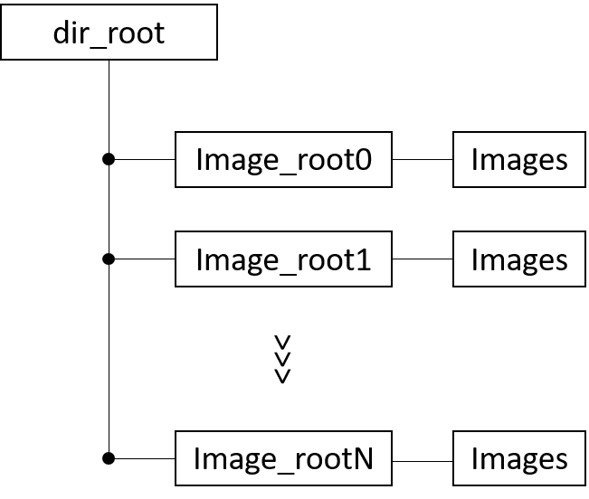
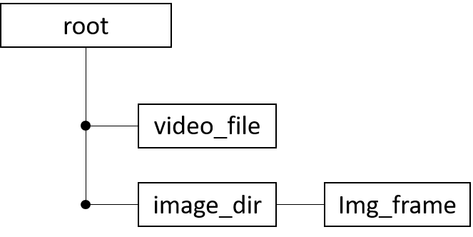

# main_class3.py
3クラス分類用
Requiremetns

# mymodule
## create_dataset
chainer用のデータセットを作る関数
### create_data_set(dir_root, image_root_set, label_set, N)
imge_root_set及びlabel_setは，python list型です．
Nは指定したフォルダ内部の画像のうち，何枚使うかを指定します．フォルダ内の画像がNよりも少ない場合には，全部を使うことになっています．

Requiremetns
###　search_img_name(image_root)
image_root内部にjpg画像が何枚あるかを検索し，そのfile名をlistで返す関数

## generate_image
### video2frames(root='.', video_file='video.mov', image_dir='image_dir', image_file='img_frame', extension='.jpg', interval=0)

上記のようなディレクトリ構造で動画が，フレームごとに分解される．
intervalは，intervalフレームごとに取るということにして要る．
NOTE :　　
- video_fileは，MOVでなくても大丈夫です．例えば，DVI等でも大丈夫です．
- extensionもjpg以外も可能ですが，chainerがjpg, pngにしか対応していない.

## network_composition
ネットワーク構造の関数
- ネットワーク構造構造の定義は，このファイル内部に書き込んでいってください．
Requiremetns

## Enbironment
実行環境
とりあえず自分のところで動作した最小環境をrequirements.txtに書き出しておきました．　　
python，本体は，3.6.6です．requirements.txtをpip installとかすれば楽に環境構築できるはず．（多分）　　
generate_dataset\processing\の関数の一部は，python2系列っぽいので，注意してください．
